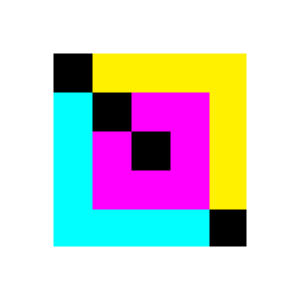
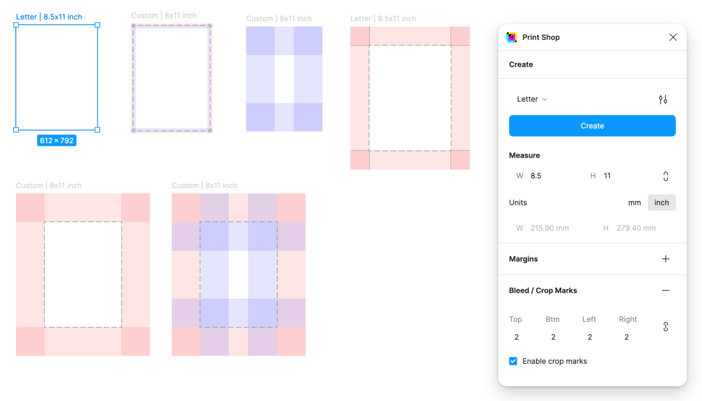

	
	<h1>Print Shop</h1>
	

		<b>Create Production-Grade Print Materials the Figma Way</b>
	

	 
	 
	 

## Install
[Figma Community Plugin link](https://www.figma.com/community/plugin/1424982146746230741/print-shop)

## Features
Features are listed under our plans on our [product page](https://polar.sh/printshop/)

## FAQs

#### Is there a free trial?

Yes, you can use the plugin for 14 days after which you would need to purchase a one-time membership. It includes all features and upgrades within a year from purchase.

#### I'm having issues with my account. How do I get in touch?

For questions related directly to your account such as billing and upgrades, you can email me directly at printshop[at]artivilla.com.

#### I don't see the artboard or the grids when I hit create?

You need to enable `Show layout grids` by hitting shift+G or finding it in the figma quick menu bar UI3 panel (cmd+k). The frame gets created in the middle of the artboard so you might need to zoom out or move to the center of the canvas. This is a known bug.

#### How do I manage my presets?

Also a missing feature that will be added in upcoming releases.

## Built with
- [Create Figma Plugin](https://yuanqing.github.io/create-figma-plugin/)
- [Tailwind](https://tailwindcss.com/) for styles
- [TurboRepo](https://turbo.build/repo/docs) for builds
- [Jotai](https://jotai.org/docs/core/store) for state management
- [Polar](https://polar.sh/) for payments
- [Drizzle](https://orm.drizzle.team/docs/overview) for orm db management and migrations
- Hosted on [Railway](https://railway.app/)

built using [zed](https://zed.dev/) + assisted using [claude 3.5 sonnet](https://www.anthropic.com/news/claude-3-5-sonnet)

## Author
[Arti Villa](https://artivilla.com/)
